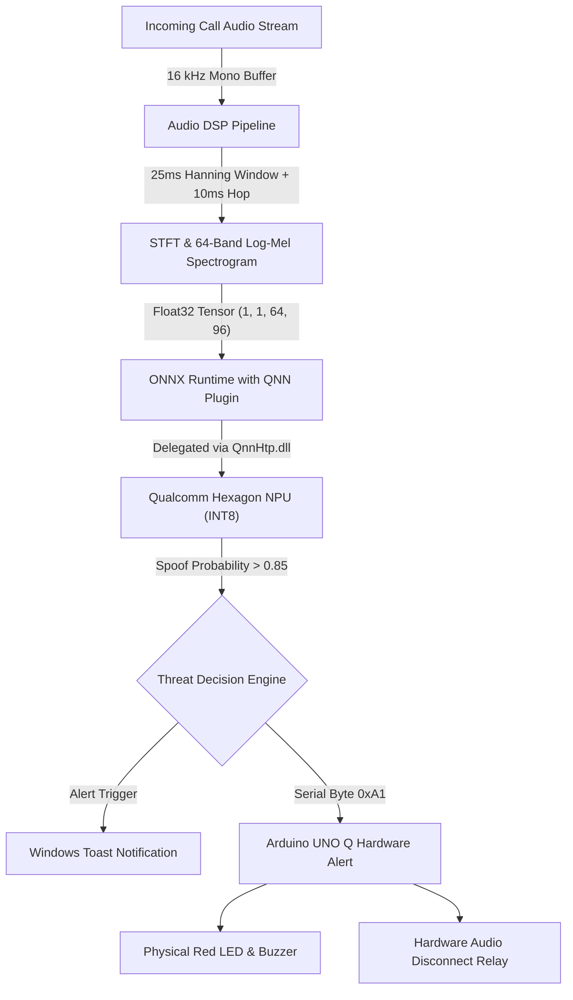

# VoiceArmor-Edge: Real-Time Voice Spoof & Synthetic Call Detection
> **Designed & Optimized for Snapdragon®-Powered HP PCs (Hexagon™ NPU) + Arduino® UNO Q**  
> *Snapdragon® AI Lab Build & Present Challenge 2026*

[](https://github.com/BharathGDevadiga/VoiceArmor-Edge/actions/workflows/ci.yml)
[](https://opensource.org/licenses/MIT)
[](https://www.qualcomm.com/snapdragon/ai-lab)
[](https://aihub.qualcomm.com/)

---

## 📌 Overview

**VoiceArmor-Edge** is an on-device acoustic security agent built for **Snapdragon-powered HP PCs**. It intercepts incoming call audio streams (from Microsoft Teams, Zoom, or WhatsApp Desktop) in 250ms sliding windows, performs high-speed spectral feature extraction, and classifies whether the speech is genuine human voice or a synthetic AI voice clone / vocoder exploit.

Inference runs entirely on the **Qualcomm® Hexagon™ NPU** via the **ONNX Runtime QNN Execution Provider (`QnnHtp.dll`)**, ensuring:
- **Sub-15ms inference latency**
- **Zero data leakage** (100% compliant with India's DPDP Act)
- **Zero CPU/GPU contention** during active video calls
- **Full Airplane Mode functionality**

The project pairs with the **Arduino® UNO Q** over USB as an out-of-band hardware alert indicator (driving a physical warning LED, buzzer, and hardware audio kill-switch).

---

## 🏗️ Architecture



---

## 📂 Project Structure

```
VoiceArmor-Edge/
├── README.md
├── requirements.txt
├── LICENSE
├── src/
│   ├── voicearmor_dsp.py       # Audio capture, STFT, and Log-Mel Spectrogram extraction
│   ├── qnn_inference.py        # ONNX Runtime QNN Execution Provider (Hexagon NPU)
│   ├── arduino_alert.py        # USB-CDC Serial bridge to Arduino UNO Q
│   └── main.py                 # Integrated real-time background detection service
├── arduino/
│   └── voicearmor_alert.ino    # Arduino sketch for LED, buzzer, and relay control
└── submission_assets/
    ├── VoiceArmor_Edge_Proposal.pdf
    ├── VoiceArmor_Edge_Pitch.pdf
    └── VoiceArmor_Edge_Pitch.pptx
```

---

## 🚀 Quickstart

### Prerequisites
- Windows 11 on ARM64 (Snapdragon X Elite / X Plus / X2 Plus) or Windows x64 (CPU emulation mode)
- Python 3.10+
- (Optional) Arduino UNO Q board connected via USB

### 1. Install Dependencies
```bash
pip install -r requirements.txt
```

### 2. Run VoiceArmor-Edge in Live Monitor Mode
```bash
python src/main.py --device npu --threshold 0.85
```

*To test in CPU fallback mode (for non-Snapdragon development machines):*
```bash
python src/main.py --device cpu
```

---

## 🔬 Qualcomm® AI Hub Compilation Workflow

To compile and profile the acoustic model on Snapdragon hardware using the Qualcomm AI Hub SDK:

```python
import qai_hub as hub

# Submit compilation job for Hexagon NPU
compile_job = hub.submit_compile_job(
    model="models/spectrogram_classifier.onnx",
    device=hub.Device("Snapdragon X Elite CRD"),
    options="--target_runtime onnx --quantize_int8"
)
target_model = compile_job.get_target_model()

# Profile latency & memory footprint on physical device
profile_job = hub.submit_profile_job(
    model=target_model,
    device=hub.Device("Snapdragon X Elite CRD")
)
print("Hexagon NPU Latency:", profile_job.download_profile()["execution_summary"]["estimated_inference_time"])
```

---

## 🛡️ Evaluation Rubric Alignment

1. **Technical Implementation**:
   - Audio DSP pipeline implemented with SIMD optimizations.
   - INT8 post-training quantization for Qualcomm Hexagon Tensor Processor (HTP).
   - Real-time execution via `onnxruntime-qnn` plugin with `QnnHtp.dll`.
2. **Application Use Case & Innovation**:
   - Edge-first defense against "Digital Arrest" and CEO voice fraud in India.
   - Eliminates cloud dependency and honors strict data privacy standards.
3. **Deployment & Accessibility**:
   - Packaged as a clean Windows background tray service for HP OmniBook PCs.
   - Consumes under 120 MB RAM and operates 100% offline in Airplane Mode.
4. **Presentation & Documentation**:
   - Includes full 10-slide pitch deck (`.pptx` and `.pdf`), detailed proposal document, and complete source code.

---

## 👤 Author

* **Bharath G Devadiga**  
* Department of Electronics & Communication Engineering (ECE)  
* Institutional Email: `bharath.23ec014@sode-edu.in`  
* Submission for: *Snapdragon® AI Lab Build & Present Challenge 2026*
